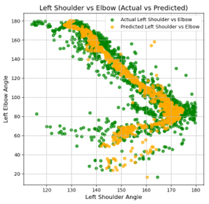
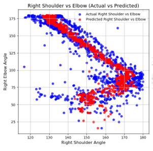
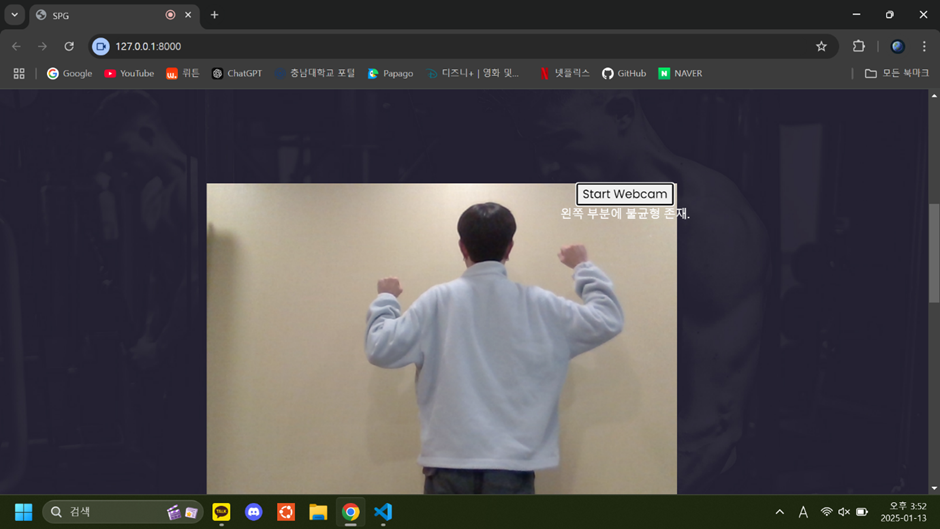

## 📗 목차

1. [📝 개요](#📝-1.-포트폴리오-개요)
2. [📚 문제정의](#📚-2.-문제정의)
3. [📃 사용 데이터](#📃-3.-사용-데이터)
4. [📊 데이터 전처리](#📊-4.-데이터-전처리)
5. [📈 EDA](#📈-5.-EDA)
6. [🤖 AI 모델 개발](#🤖-6.-AI-모델-개발)
7. [💡 결론](#💡-7.-결론)

## **📝 1. 포트폴리오 개요**
프로젝트 명 : 시각 장애인을 위한 운동 도우미 서비스 개발 – 운동자세 피드백

작업기간 : 2024.11 – 2025.01

작업분류 : 팀 프로젝트(3명)

사용 언어 :  Python

Mediapipe  - Motion detection을 활용하여 정자세의 신체부위 각도를 AI 모델에 학습 시킨 후  실시간 웹캠에 나오는 자세를 보고 불균형 판단

    

## **📚 2. 문제정의**
시각장애인은 자신의 자세를 직접 확인하기 어려워 잘못된 자세 지속, 근육 불균형, 부상 위험이 증가하며, 운동 효율이 감소 이러한 문제를 해결하기 위해 실시간 자세 분석과 올바른 자세 유지를 위한 효과적인 피드백 제공 시스템이 필요

## **📃 3. 사용 데이터**
정자세 데이터는 유튜브의 올바른 운동 자세 영상을 활용해 추출

오자세 데이터는 직접 촬영 및 유튜브의 잘못된 자세 영상을 활용해 수집

## **📊 4. 데이터 전처리**
운동 MP4 영상을 프레임 단위로 처리하여 다수의 이미지로 변환하고, Mediapipe(신체 관절 등 다양한 특징을 실시간 감지·추적하는 오픈소스 라이브러리) Landmark를 활용해 관절 위치 데이터를 추출

추출된 데이터를 기반으로 관절 각도를 계산하여 자세를 수치화

이상치가 너무 많아 데이터 범위를 고려하여 임계치 지정 후 이상치 제거

## **📈 5. EDA**
데이터를 보았을 때 비선형적이므로 결정 트리를 기반으로 한 복잡한 패턴도  점진적 잔차 개선을 활용해 잘 파악할 수 있는 Gradient Boosting Regressor가 적합하다고 생각

오른쪽, 왼쪽 관절 각도가 다르므로 불균형을 나누어서 파악할 수 있게 하나의 input으로 여러 개의 output을 출력할 수 있는 MultiOutputRegressor 사용

## **🤖 6. AI 모델 개발**
전처리된 데이터를 Gradient Boosting Regressor를 사용하여 MultiOutputRegressor로 오른쪽 왼쪽 각도 각각 학습 

Gradient Boosting Regressor의 최적의 파라미터를 구하기 위해 GridSearchCV를 사용

 

## **💡 7. 결론**

Django 기반 웹 페이지 구현: 학습시킨 AI모델을 연동하여 웹캠을 활용한 실시간 영상 분석 및 음성 피드백 제공으로 시각적 의존도 최소화. 시각적 제한이 있는 사용자를 위한 운동 자세 개선 솔루션 구축.

사용자 베타테스트 결과: 시각적 정보 차단 상황에서도 음성 피드백 활용이 용이하다는 결과 확인.

